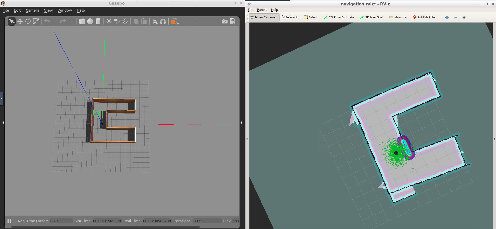

## UdacityRobotics-home-service-robot
Project 5 of term 1 of the Udacity Robotics Nanodegree

In this project, a robot is moved from a start position to a pickup position, 
and object is 'picked up', and then 'moved' to a drop-off position.
The robot only moves to pickup and drop-off locations,
and the 'picking up' and 'dropping off' is done by displaying a cube at the pickup zone,
hiding it when the robot arrives, and displaying it by the drop-off zond when the 
robot arrives at the drop-off zone.  The pickup and drop-off zones are shown by the blue cube.

Here is the robot moving to the pickup zone:
(The pickup zone is marked by the blue cube)

Here is the robot moving to the drop-off zone:
(The green line shows the path the robot plans to take.)

Here is the robot at the drop-off zone:
(Notice the blue cube by the robot that the robot 'dropped off')


### Project Startup & Configuration
To bring the workspace up and running, execute the following commands in the terminal:
```bash
mkdir -p ~/catkin_ws/src
cd ~/catkin_ws/src
catkin_init_workspace
cd ..
catkin_make
sudo apt-get update
cd ~/catkin_ws/src
git clone https://github.com/ros-perception/slam_gmapping
git clone https://github.com/turtlebot/turtlebot
git clone https://github.com/turtlebot/turtlebot_interactions
git clone https://github.com/turtlebot/turtlebot_simulator
cd ~/catkin_ws/
source devel/setup.bash
rosdep -i install gmapping
rosdep -i install turtlebot_teleop
rosdep -i install turtlebot_rviz_launchers
rosdep -i install turtlebot_gazebo
catkin_make
source devel/setup.bash
```

To create the pick_objects package, perform the following command:
(This is not necessary you pull the repo)
```
catkin_create_pkg pick_objects move_base_msgs actionlib roscpp
```

To create the add_markers package, perform the following command:
```
catkin_create_pkg add_markers 
```

Copy these lines into the /home/workspace/.student_bashrc file and run `source /home/workspace/.student_bashrc`
This will eliminate the `No module named rospkg` error when starting gazebo.
```bash
export PATH=/usr/bin:$PATH
source /opt/ros/kinetic/setup.bash
alias ss="source devel/setup.bash"
```

### catkin_ws/src setup
Clone the github repo and copy folders into the catkin/src directory:
```
cd ~/catkin_ws
git clone https://github.com/Wubuntu88/UdacityRobotics-home-service-robot.git
cp -R UdacityRobotics-home-service-robot/map src/
cp -R UdacityRobotics-home-service-robot/pick_objects src/
cp -R UdacityRobotics-home-service-robot/add_markers src/
```

You will need to rebuild the project:
```
cd ~/catkin_ws
rm -rf build/
catkin_make
```

### Generate the map
Run the test_slam.sh file and create a map by looking at RViz so that it looks like the Gazebo world.
When the RViz display looks like the Gazebo display, run the mapsaver command:
```bash
cd ~/catkin_ws
bash UdacityRobotics-home-service-robot/scripts/test_slam.sh
```
```bash
rosrun map_server map_saver
```
to get a map.pgm and map.yaml file.
the map.yaml file is referenced in the test_navigation.sh script.

The map is located here and is used in the start scripts:
https://github.com/Wubuntu88/UdacityRobotics-home-service-robot/tree/main/pick_objects/map

Here is a visualization of what the map looks like in RViz:


### Running the Home Service Robot.
Run the `home_service_robot.sh` to complete the project and see the robot perform pickup and drop-off.
The `home_service_robot.sh` will launch:
1) The C shape Gazebo world that I made,
2) The Turtlebox Gazebo AMCL demo that will localize the robot with AMCL.
3) A custom Rviz config launch that is identical to view_navigation.launch, but automatically subscribes to `visualization_marker` messages.
4) The `pick_objects` c++ executable that commands the robot for a pickup and drop-off run.
5) The `add_markers` c++ executable that displays the marker at the pickup location, then the drop-off location.
```bash
cd ~/catkin_ws
source devel/setup.bash
bash UdacityRobotics-home-service-robot/scripts/home_service_robot.sh
```

The user can also run the `test_slam.sh`, `test_navigation.sh` scripts,
`rosrun pick_objects pick_objects`, or `rosrun add_markers add_markers`
to view independent behavior.

The test_navigation.sh script should run this:


### Catkin Workspace Structure
The catkin workspace should look like this:
```
root@865d9fec6953:/home/workspace/catkin_ws/src# tree
.
|-- CMakeLists.txt -> /opt/ros/kinetic/share/catkin/cmake/toplevel.cmake
|-- add_markers
|   |-- CMakeLists.txt
|   |-- add_markers.cpp
|   |-- include
|   |   `-- add_markers
|   |-- package.xml
|   `-- src
|       `-- add_markers.cpp
|-- map
|   |-- c_model
|   |   `-- model
|   |       |-- model.config
|   |       `-- model.sdf
|   |-- c_shape.world
|   |-- c_shape_model
|   |   |-- model.config
|   |   `-- model.sdf
|   |-- map.pgm
|   `-- map.yaml
|-- pick_objects
|   |-- CMakeLists.txt
|   |-- include
|   |   `-- pick_objects
|   |-- launch
|   |   `-- marker_viz_rviz.launch
|   |-- package.xml
|   |-- rvizConfig
|   |   `-- home_service_visualization_marker_config.rviz
|   `-- src
|       `-- pick_objects.cpp
|-- slam_gmapping
|-- turtlebot
|-- turtlebot_interactions
`-- turtlebot_simulator


```
